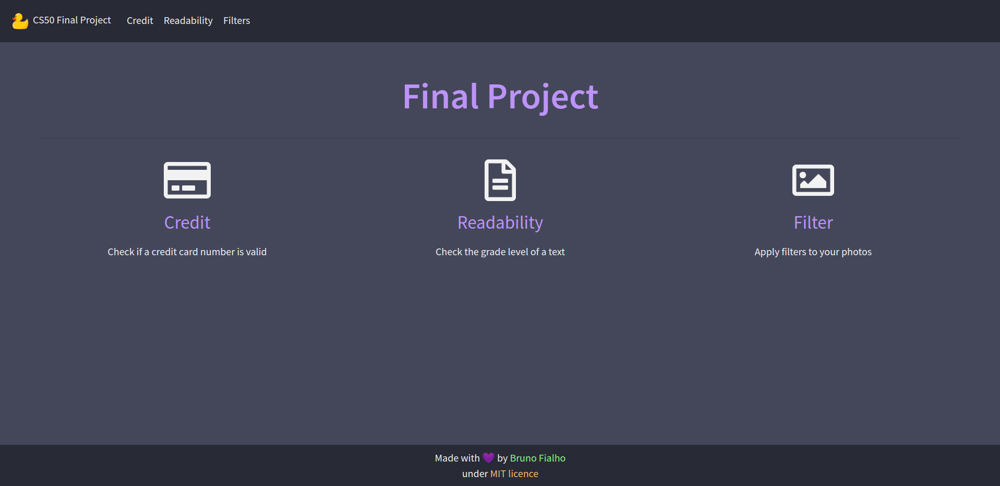

<h2 align="center">
    CS50 Final Project
</h2>

  

  

  

  

  

  

## :rocket: Introduction

Create a responsive website using HTML, CSS, [Bootstrap](https://getbootstrap.com/), Javascript, Python and [Flask](https://flask.palletsprojects.com/en/1.1.x/), to demonstrate some of my favorite projects during CS50:

- Credit
- Readability
- Filters

## :desktop_computer: Final Project

Users can test the algorithms originally written in C, which are now in python. This website is fully responsive, with media queries to change font-size and padding. And it is also inspired by Dracula's dark theme.