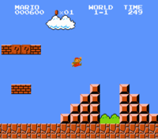

<h2 align="center">
  Problem Set 6
</h2>

<p align="center">
  
</p>

## :rocket: Introduction

Five problems in Python:

- [Hello](#desktop_computer-hello)
- [Mario](#desktop_computer-mario)
- [Credit](#desktop_computer-credit)
- [Readability](#desktop_computer-readability)
- [Dna](#desktop_computer-dna)

## :desktop_computer: [Hello](https://cs50.harvard.edu/x/2020/psets/6/hello/)

*Python version of 'Hello' from the [Pset1](https://github.com/bruno-fialho/cs50/tree/master/pset1) in C.*

A program that prints out a simple greeting to the user, per the below.

```
$ python hello.py
What is your name?
David
hello, David
```

## :desktop_computer: [Mario](https://cs50.harvard.edu/x/2020/psets/6/mario/)



*Python version of 'Mario' from the [Pset1](https://github.com/bruno-fialho/cs50/tree/master/pset1) in C.*

A program that prints out a double half-pyramid of a specified height, per the below.

```
$ python mario.py
Height: 4
   #  #
  ##  ##
 ###  ###
####  ####
```

## :desktop_computer: [Credit](https://cs50.harvard.edu/x/2020/psets/6/credit/)

*Python version of 'Credit' from the [Pset1](https://github.com/bruno-fialho/cs50/tree/master/pset1) in C.*

The program prompts user for a number and uses Luhn’s Algorithm to calculate the checksum. Then it checks, with the length and starting digits, if it's a valid number.

The only output of the program is the result: `AMEX`, `MASTERCARD`, `VISA` or `INVALID`.

```
$ python credit.py
Number: 378282246310005
AMEX
```

## :desktop_computer: [Readability](https://cs50.harvard.edu/x/2020/psets/6/readability/)

*Python version of 'Readability' from the [Pset2](https://github.com/bruno-fialho/cs50/tree/master/pset2) in C.*

A program that computes the approximate grade level needed to comprehend some text, per the below.

```
$ python readability.py
Text: Congratulations! Today is your day. You're off to Great Places! You're off and away!
Grade 3
```
The program prompt user for text, and then outputs Coleman-Liau index. The Coleman-Liau index of a text is designed to output what (U.S.) grade level is needed to understand the text. The formula is:

```
index = 0.0588 * L - 0.296 * S - 15.8
```
Where `L` is the average number of letters per 100 words in the text, and `S` is the average number of sentences per 100 words in the text.

## :desktop_computer: [Dna](https://cs50.harvard.edu/x/2020/psets/6/dna/)

A program that identifies a person based on their DNA, per the below.

```
$ python dna.py databases/large.csv sequences/5.txt
Lavender
```

DNA is a sequence of molecules called nucleotides, each nucleotide of DNA contains one of four different bases: adenine (A), cytosine (C), guanine (G), or thymine (T). Every human cell has billions of these nucleotides arranged in sequence.

A STR (Short Tandem Repeat) is a short sequence of DNA bases that tends to repeat consecutively numerous times at specific locations inside of a person’s DNA. The number of times any particular STR repeats varies a lot among individuals. In the DNA samples below, for example, Alice has the STR AGAT repeated four times in her DNA, while Bob has the same STR repeated five times.


The sequence is a big string with letters A, C, G and T:

```
AAGGTAAGTTTAGAATATAAAAGGTGAGTTAAATAGAATAGGTTAAAATTAAAGGAGATCAGATCAGATCAGATCTATCTATCTATCTATCTATCAGAAAAGAGTAAATAGTTAAAGAGTAAGATATTGAATTAATGGAAAATATTGTTGGGGAAAGGAGGGATAGAAGG
```

The database is a CSV file, that contain some individuals and its STRs:

```
name,AGAT,AATG,TATC
Alice,28,42,14
Bob,17,22,19
Charlie,36,18,25
```

The data in the above file would suggest that Alice has the sequence AGAT repeated 28 times consecutively somewhere in her DNA, the sequence AATG repeated 42 times, and TATC repeated 14 times. Bob, meanwhile, has those same three STRs repeated 17 times, 22 times, and 19 times, respectively. And Charlie has those same three STRs repeated 36, 18, and 25 times, respectively. These values are for the longest consecutive STR sequence repeated.

Given some context, let's go back to the program:

The program accepts two command-line arguments, the database and the sequence, the database is a CSV file, and the sequence is a text file. Then it opens the CSV file and the DNA sequence, and read its contents into memory.

For each of the STRs, the program computes the longest run of consecutive repeats of the STR in the DNA sequence to identify.

If the STR counts match exactly with any of the individuals in the CSV file, the program print out the name of the matching individual.
