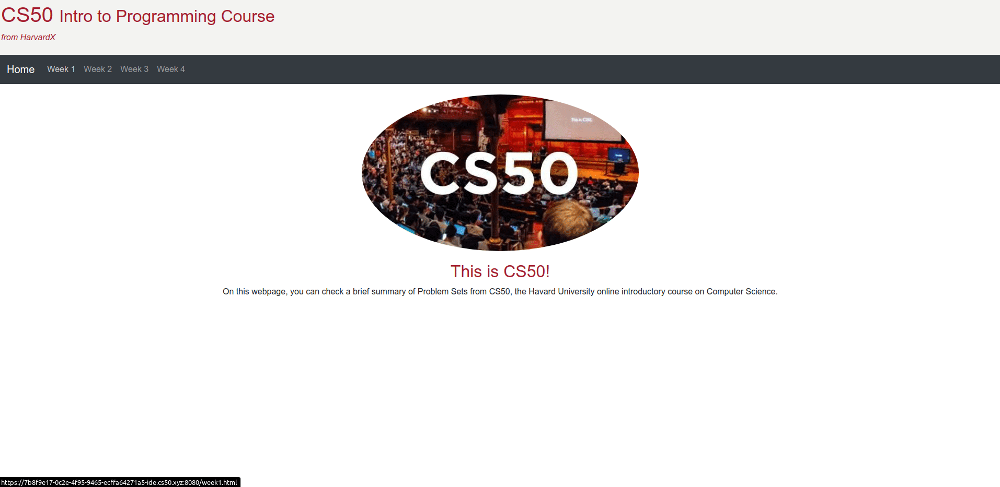

<h2 align="center">
  Problem Set 8
</h2>

  

  

  

  

  

  

## :rocket: Introduction

Two webpages using HTML, CSS, [Bootstrap](https://getbootstrap.com/), Javascript, SQL and Python:

- [Homepage](#desktop_computer-homepage)
- [Finances](#desktop_computer-finances) :construction:

## :desktop_computer: [Homepage](https://cs50.harvard.edu/x/2020/psets/8/homepage/)

A simple homepage using HTML, CSS, Bootstrap and JavaScript.

## :desktop_computer: [Finance](https://cs50.harvard.edu/x/2020/psets/8/finance/)

:construction: