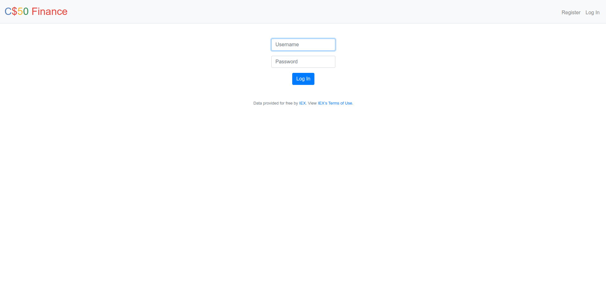
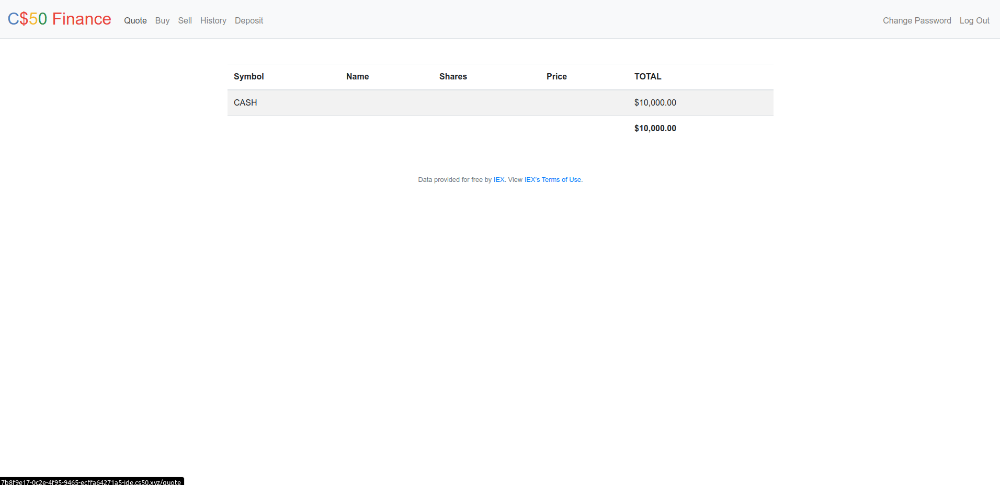

<h2 align="center">
  Problem Set 8
</h2>

  

  

  

  

  

  

  

## :rocket: Introduction

Two webpages using HTML, CSS, [Bootstrap](https://getbootstrap.com/), Javascript, SQL and Python:

- [Homepage](#desktop_computer-homepage)
- [Finance](#desktop_computer-finance)

## :desktop_computer: [Homepage](https://cs50.harvard.edu/x/2020/tracks/web/homepage/)

A simple homepage using HTML, CSS, Bootstrap and JavaScript.

## :desktop_computer: [Finance](https://cs50.harvard.edu/x/2020/tracks/web/finance/)

A website via which users can “buy” and “sell” stocks by querying [IEX Cloud API](https://iexcloud.io/docs/api/) for stocks’ prices, a la the below.

- User's Login, Register and Change Password:

- User's Quote, Buy, Sell, History and Deposit:

The website has the following features:

- **`Allow the user to register an account`**: The `Register` page allows user to register a new account to database.

- **`Allow user to login`**: The `Login` page allows the login of a registered user in the database and redirects to the `Index` page.

- **`Allow user to logout`**: The `Log Out` button on top right of pages allow user to logout.

- **`Allow user to change password`**: The `Password` page allows the user to change password.

- **`Show the user stock's and cash balance`**: The `Index` page shows stocks the user owns, the numbers of shares owned, the current price of each stock, and the total value of each holding. Also display the user’s current cash balance along with a grand total.

- **`Allow user to quote stock’s current price`**: The `Quote` page allows user to quote any stock's current price by querying the API.

- **`Allow user to buy stocks`**: The `Buy` page allows user to buy stock's if user has enough cash available.

- **`Allow user to sell stocks`**: The `Sell` page allows user to sell shares of a stock owned.

- **`Allow user to deposit more cash`**: The `Deposit` page allows user to deposit up to $10,000.00, symbolically choosing a credit card brand.

- **`Show user transactions history`**: The `History` page shows all user's transactions.
